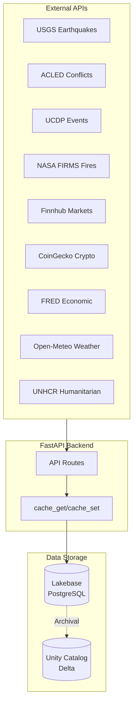
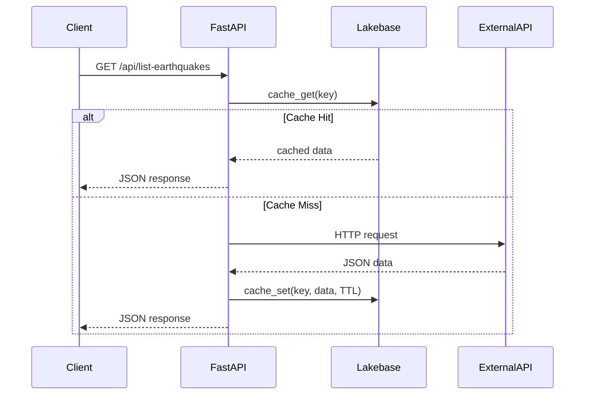
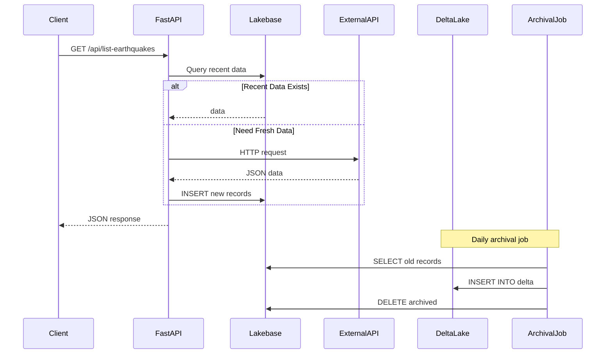
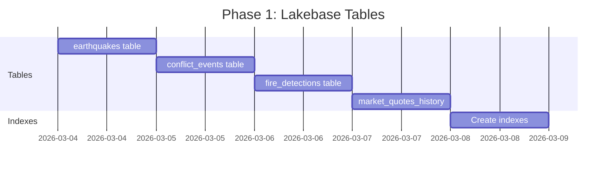

# Backend Data Architecture Analysis

## Overview

This document analyzes all API endpoints, data sources, and storage patterns to ensure optimal latency and data retention for time-based navigation (24h, 7d, 30d).

---

## Architecture Overview



---

## Endpoint Analysis

### Current State Matrix

| Endpoint | External API | First Storage | Delta Sync | Cache TTL | Time Range Support | Issues |
|----------|-------------|---------------|------------|-----------|-------------------|--------|
| `/api/list-earthquakes` | USGS | Lakebase (cache) | No | 5 min | Yes (start/end) | No persistence |
| `/api/significant-earthquakes` | USGS | Lakebase (cache) | No | 5 min | Yes (days) | No persistence |
| `/api/list-acled-events` | ACLED | Lakebase (cache) | No | 15 min | Yes (start/end) | Needs API key |
| `/api/list-ucdp-events` | UCDP | Lakebase (cache) | No | 1 hour | Yes (start/end) | Needs API key |
| `/api/humanitarian-summary/{code}` | UNHCR | Lakebase (cache) | No | 1 hour | No | Static data |
| `/api/list-fire-detections` | NASA FIRMS | Lakebase (cache) | No | 30 min | No | Needs API key |
| `/api/list-vessels` | Synthetic | Lakebase | No | 1 min | No | Synthetic only |
| `/api/snapshot` | Synthetic | Lakebase | No | 30 sec | No | Synthetic only |
| `/api/routes` | Lakebase/UC | **Hybrid** | Yes | No | Yes (hours) | Working |
| `/api/list-market-quotes` | Finnhub | Lakebase (cache) | No | 5 min | No | Market hours only |
| `/api/list-crypto-quotes` | CoinGecko | Lakebase (cache) | No | 5 min | No | No historical |
| `/api/list-forex-quotes` | Finnhub | Lakebase (cache) | No | 5 min | No | No historical |
| `/api/list-economic-indicators` | FRED | Lakebase (cache) | No | 6 hours | No | Monthly data |
| `/api/world-bank-indicators` | World Bank | Lakebase (cache) | No | 6 hours | No | Annual data |
| `/api/list-cyber-threats` | Synthetic | Lakebase (cache) | No | 30 min | Yes (days_back) | Synthetic only |
| `/api/cyber-stats` | Synthetic | Lakebase (cache) | No | 1 hour | No | Synthetic only |
| `/api/list-service-statuses` | Internal | Lakebase (cache) | No | 5 min | No | No historical |
| `/api/outages/{service}` | Internal | Lakebase (cache) | No | 5 min | No | No historical |
| `/api/risk-scores` | Calculated | Lakebase (cache) | No | 30 min | No | No historical |
| `/api/intel-brief` | LLM | Lakebase (cache) | No | 1 hour | No | AI generated |

---

## Storage Pattern Analysis

### Current Pattern: Cache-Only



**Problems:**
- Data lost when TTL expires
- Cannot query historical data
- No time-series analysis capability

### Recommended Pattern: Lakebase-First with Delta Sync



---

## Gap Analysis by Data Type

### 1. Seismic Data (USGS)

**Current:**
- Cache-only storage (5 min TTL)
- Time range supported but data lost after cache expires

**Needed:**
- Lakebase table: `earthquakes`
- Columns: `id, magnitude, latitude, longitude, depth, place, occurred_at, alert_level`
- Retention: 30 days in Lakebase, archive to Delta

**Proposed Schema:**
```sql
CREATE TABLE earthquakes (
    id TEXT PRIMARY KEY,
    magnitude DOUBLE PRECISION,
    latitude DOUBLE PRECISION,
    longitude DOUBLE PRECISION,
    depth DOUBLE PRECISION,
    place TEXT,
    occurred_at TIMESTAMP WITH TIME ZONE,
    alert_level TEXT,
    tsunami_warning BOOLEAN,
    felt_reports INTEGER,
    url TEXT,
    fetched_at TIMESTAMP WITH TIME ZONE DEFAULT NOW()
);

CREATE INDEX idx_earthquakes_occurred ON earthquakes(occurred_at);
CREATE INDEX idx_earthquakes_magnitude ON earthquakes(magnitude);
```

### 2. Conflict Data (ACLED/UCDP)

**Current:**
- Cache-only storage (15 min / 1 hour TTL)
- Requires API keys (missing)

**Needed:**
- Lakebase table: `conflict_events`
- Columns: `id, source, event_type, country, location, latitude, longitude, occurred_at, fatalities, actors`
- Retention: 30 days in Lakebase

**Proposed Schema:**
```sql
CREATE TABLE conflict_events (
    id TEXT PRIMARY KEY,
    source TEXT NOT NULL, -- 'acled' or 'ucdp'
    event_type TEXT,
    country TEXT,
    admin1 TEXT,
    location TEXT,
    latitude DOUBLE PRECISION,
    longitude DOUBLE PRECISION,
    occurred_at TIMESTAMP WITH TIME ZONE,
    fatalities INTEGER DEFAULT 0,
    actors TEXT[], -- PostgreSQL array
    notes TEXT,
    fetched_at TIMESTAMP WITH TIME ZONE DEFAULT NOW()
);

CREATE INDEX idx_conflicts_occurred ON conflict_events(occurred_at);
CREATE INDEX idx_conflicts_country ON conflict_events(country);
```

### 3. Wildfire Data (NASA FIRMS)

**Current:**
- Cache-only storage (30 min TTL)
- No time range support
- Requires API key (missing)

**Needed:**
- Lakebase table: `fire_detections`
- Columns: `fire_id, latitude, longitude, brightness, confidence, acq_date, satellite`
- Retention: 7 days in Lakebase (high volume data)

**Proposed Schema:**
```sql
CREATE TABLE fire_detections (
    id BIGSERIAL PRIMARY KEY,
    fire_id TEXT,
    latitude DOUBLE PRECISION NOT NULL,
    longitude DOUBLE PRECISION NOT NULL,
    brightness DOUBLE PRECISION,
    confidence INTEGER,
    acq_date DATE,
    acq_time TEXT,
    satellite TEXT,
    frp DOUBLE PRECISION, -- Fire Radiative Power
    fetched_at TIMESTAMP WITH TIME ZONE DEFAULT NOW()
);

CREATE INDEX idx_fires_date ON fire_detections(acq_date);
CREATE INDEX idx_fires_location ON fire_detections(latitude, longitude);
```

### 4. Market Data (Finnhub/CoinGecko)

**Current:**
- Cache-only storage (5 min TTL)
- Current quotes only, no historical

**Needed:**
- Lakebase table: `market_quotes_history`
- Columns: `symbol, price, change, change_percent, timestamp, asset_type`
- Retention: 24 hours in Lakebase (for intraday charts)

**Proposed Schema:**
```sql
CREATE TABLE market_quotes_history (
    id BIGSERIAL PRIMARY KEY,
    symbol TEXT NOT NULL,
    asset_type TEXT, -- 'stock', 'crypto', 'forex'
    price DOUBLE PRECISION,
    change DOUBLE PRECISION,
    change_percent DOUBLE PRECISION,
    volume BIGINT,
    recorded_at TIMESTAMP WITH TIME ZONE DEFAULT NOW()
);

CREATE INDEX idx_quotes_symbol_time ON market_quotes_history(symbol, recorded_at DESC);
```

### 5. Vessel Data (Maritime)

**Current:**
- Lakebase-first storage (working)
- Hybrid query with Unity Catalog (working)
- 24h retention in Lakebase, 30+ days in Delta

**Status: IMPLEMENTED - Use as template for other data types**

---

## Retention Requirements

### Time Navigation Support

| Data Type | 24h | 7d | 30d | Storage Strategy |
|-----------|-----|-----|-----|------------------|
| Earthquakes | Required | Required | Required | Lakebase 30d + Delta |
| Conflicts | Required | Required | Required | Lakebase 30d + Delta |
| Wildfires | Required | Optional | No | Lakebase 7d + Delta |
| Vessels | Required | Required | Required | **Already implemented** |
| Markets | Required | Optional | No | Lakebase 24h + Delta |
| Cyber | Required | Required | Optional | Lakebase 14d + Delta |

### Lakebase Retention Settings

```python
# Recommended retention hours by data type
RETENTION_CONFIG = {
    "earthquakes": 720,      # 30 days
    "conflicts": 720,        # 30 days
    "wildfires": 168,        # 7 days (high volume)
    "vessels": 24,           # 24 hours (already implemented)
    "market_quotes": 24,     # 24 hours
    "cyber_threats": 336,    # 14 days
}
```

---

## Implementation Roadmap

### Phase 1: Add Lakebase Tables (Week 1)



### Phase 2: Update API Routes (Week 2)

| Route | Change Required |
|-------|-----------------|
| `seismology.py` | Add Lakebase INSERT + SELECT |
| `conflict.py` | Add Lakebase INSERT + SELECT |
| `wildfire.py` | Add Lakebase INSERT + SELECT |
| `market.py` | Add Lakebase INSERT for history |

### Phase 3: Add Archival Jobs (Week 3)

1. Create `notebooks/archive_earthquakes.py`
2. Create `notebooks/archive_conflicts.py`
3. Create `notebooks/archive_fires.py`
4. Schedule daily jobs

---

## Proposed Hybrid Query Pattern

Apply the same pattern used for vessel routes:

```python
async def get_earthquakes(hours_back: int = 24) -> list[dict]:
    """Get earthquakes using hybrid Lakebase/UC storage."""
    earthquakes = []

    # Query Lakebase for recent data
    if hours_back <= LAKEBASE_RETENTION_HOURS["earthquakes"]:
        earthquakes = await get_earthquakes_from_lakebase(hours_back)
    else:
        # Hybrid query: Lakebase + Unity Catalog
        recent = await get_earthquakes_from_lakebase(
            LAKEBASE_RETENTION_HOURS["earthquakes"]
        )
        historical = await get_earthquakes_from_unity_catalog(hours_back)
        earthquakes = merge_and_dedupe(historical, recent)

    return earthquakes
```

---

## API Key Requirements

| API | Current Status | Required For | Priority |
|-----|----------------|--------------|----------|
| ACLED | Missing | Conflict events | P1 |
| NASA FIRMS | Missing | Wildfire detections | P1 |
| UCDP | Missing | Conflict fatalities | P2 |
| Cloudflare Radar | Missing | Cyber threats | P3 |

---

## Database Initialization

Add to `server/db.py`:

```python
EARTHQUAKE_TABLE_DDL = """
CREATE TABLE IF NOT EXISTS earthquakes (
    id TEXT PRIMARY KEY,
    magnitude DOUBLE PRECISION,
    latitude DOUBLE PRECISION,
    longitude DOUBLE PRECISION,
    depth DOUBLE PRECISION,
    place TEXT,
    occurred_at TIMESTAMP WITH TIME ZONE,
    alert_level TEXT,
    fetched_at TIMESTAMP WITH TIME ZONE DEFAULT NOW()
);
CREATE INDEX IF NOT EXISTS idx_earthquakes_occurred ON earthquakes(occurred_at);
"""

async def init_all_tables() -> None:
    """Initialize all Lakebase tables for persistence."""
    await init_cache_table()
    await init_vessel_positions_table()
    await init_earthquakes_table()  # NEW
    await init_conflicts_table()    # NEW
    await init_fires_table()        # NEW
    await init_quotes_table()       # NEW
```

---

## Summary

### Current State

| Aspect | Status |
|--------|--------|
| Lakebase caching | Working |
| Vessel hybrid storage | Working |
| Other data persistence | Not implemented |
| Time navigation (24h) | Partial |
| Time navigation (7d) | Not working |
| Time navigation (30d) | Not working |

### Target State

| Aspect | Status |
|--------|--------|
| Lakebase as first storage | All data types |
| Delta archival | All data types |
| Time navigation (24h) | All endpoints |
| Time navigation (7d) | Most endpoints |
| Time navigation (30d) | Critical endpoints |

### Priority Actions

1. **P0**: Add Lakebase tables for earthquakes, conflicts
2. **P1**: Update routes to use Lakebase-first pattern
3. **P1**: Obtain missing API keys (ACLED, NASA FIRMS)
4. **P2**: Create archival notebooks for each data type
5. **P3**: Add Unity Catalog historical queries
