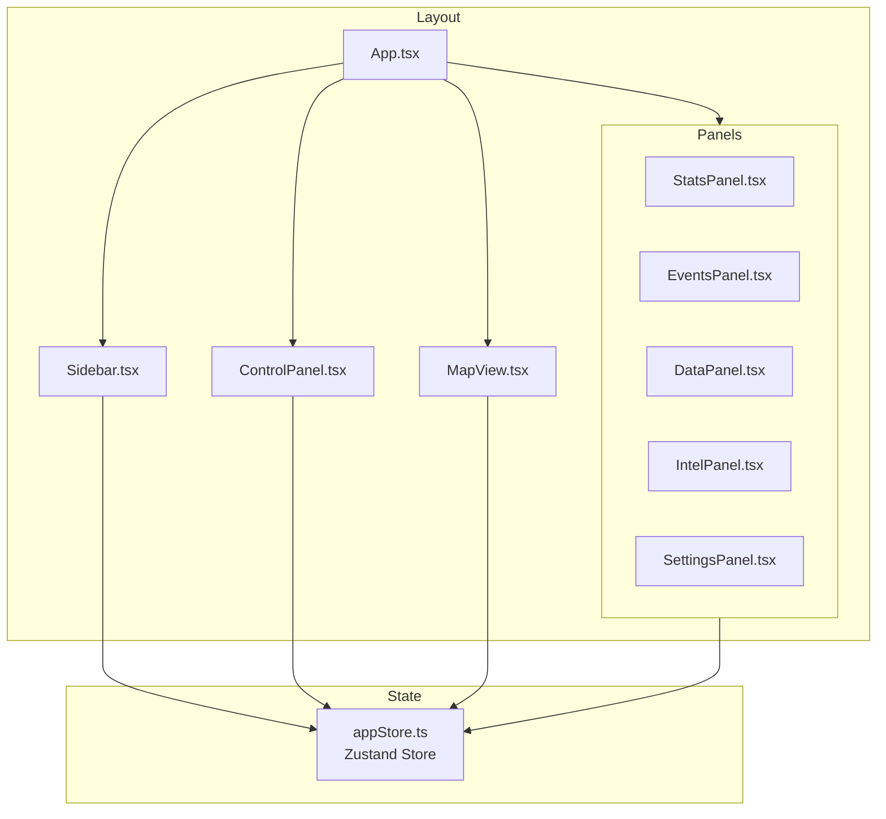
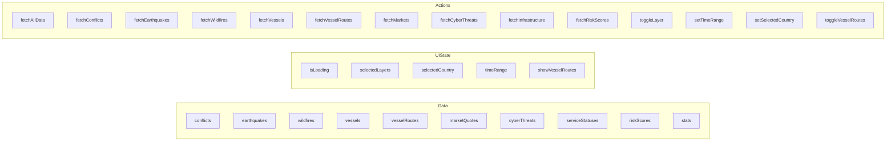
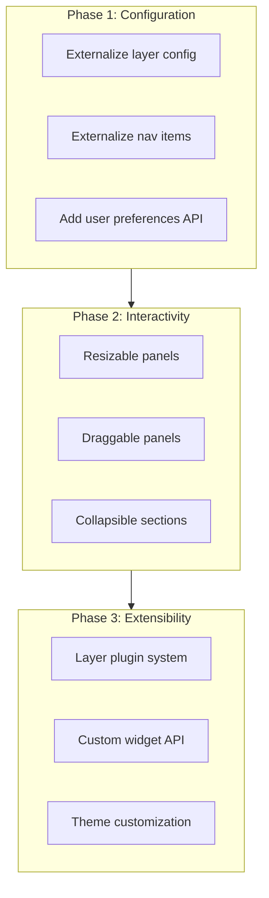

# Frontend Component Analysis

## Overview

This document analyzes all UI components in the World Monitor React frontend for extensibility, interactivity, and configuration options in the Databricks Apps context.

---

## Component Inventory



---

## 1. Sidebar Component (`Sidebar.tsx`)

### Current Features

| Feature | Status | Description |
|---------|--------|-------------|
| Collapsible | Yes | Toggle via Menu button |
| Navigation | Yes | 10 routes with icons |
| Active highlighting | Yes | Blue background on active route |
| Settings link | Yes | Bottom of sidebar |
| Live indicator | Yes | Green pulse when expanded |

### Interactivity

| Interaction | Handler | Extensibility |
|-------------|---------|---------------|
| Collapse toggle | `onClick={() => setCollapsed(!collapsed)}` | Local state only |
| Nav item click | `<Link to={item.path}>` | React Router |
| Hover | CSS `:hover` | TailwindCSS |

### Configuration Options

```typescript
const navItems = [
  { path: '/', icon: Globe, label: 'Overview', color: 'text-blue-400' },
  // ... more items
]
```

**Extensibility Points:**
- `navItems` array is hardcoded - could be made configurable via props or store
- Width values hardcoded (`w-16`, `w-56`) - could use CSS variables
- No drag/reorder support

### Recommendations

1. **Make nav items configurable**: Pass via props or load from API
2. **Add icon customization**: Allow custom icon components
3. **Add badge support**: Show counts next to nav items
4. **Resizing**: Allow user to drag sidebar width

---

## 2. ControlPanel Component (`ControlPanel.tsx`)

### Current Features

| Feature | Status | Description |
|---------|--------|-------------|
| Layer toggle | Yes | 6 layers with on/off |
| Time range | Yes | 24h, 3d, 7d, 14d, 30d |
| Vessel routes | Yes | Toggle when maritime enabled |
| Refresh button | Yes | Triggers data reload |
| Search bar | Yes | Input only (no functionality) |
| Live timestamp | Yes | Shows last update time |

### Interactivity

| Interaction | Handler | Store Action |
|-------------|---------|--------------|
| Layer toggle | `onClick={() => toggleLayer(layer.id)}` | `toggleLayer` |
| Time range change | `setTimeRange(option.value)` | `setTimeRange` + refetch |
| Routes toggle | `toggleVesselRoutes` | `toggleVesselRoutes` |
| Refresh | `fetchAllData()` | Fetches all endpoints |

### Configuration Options

```typescript
const layerOptions = [
  { id: 'conflicts', label: 'Conflicts', color: 'bg-red-500' },
  // ... more layers
]

const timeRangeOptions = [
  { value: 1, label: '24h' },
  { value: 7, label: '7 days' },
  { value: 30, label: '30 days' },
]
```

**Extensibility Points:**
- Layer options hardcoded - should be configurable
- Time range options hardcoded - should support custom ranges
- Search has no backend integration

### Recommendations

1. **Dynamic layer registry**: Load available layers from backend
2. **Custom time ranges**: Allow user-defined date ranges
3. **Implement search**: Connect to backend search API
4. **Add filter presets**: Save/load filter combinations

---

## 3. MapView Component (`MapView.tsx`)

### Current Features

| Feature | Status | Description |
|---------|--------|-------------|
| Map rendering | Yes | MapLibre GL with CARTO tiles |
| Conflict markers | Yes | Red dots with popup |
| Earthquake markers | Yes | Yellow dots scaled by magnitude |
| Fire markers | Yes | Orange dots, filtered by confidence |
| Vessel markers | Yes | Cyan dots with popup |
| Vessel routes | Yes | Cyan lines with direction arrows |
| Route hover | Yes | Popup with vessel info |
| Navigation controls | Yes | Zoom +/- |
| Scale control | Yes | Bottom-left |

### Interactivity

| Interaction | Handler | Description |
|-------------|---------|-------------|
| Marker click | `setPopup()` | Shows HTML popup |
| Marker hover | Box-shadow glow effect | CSS transition |
| Route hover | `mouseenter` on points layer | Shows timestamp/speed |
| Pan/zoom | MapLibre built-in | Mouse/touch gestures |

### Layer Configuration

```typescript
const layerColors = {
  conflict: 'rgba(239, 68, 68, 0.8)',   // red
  earthquake: 'rgba(234, 179, 8, 0.8)', // yellow
  fire: 'rgba(249, 115, 22, 0.8)',      // orange
  vessel: 'rgba(6, 182, 212, 0.8)',     // cyan
  aircraft: 'rgba(147, 51, 234, 0.8)', // purple
}
```

### Extensibility Points

| Feature | Extensible | How |
|---------|------------|-----|
| Add new layers | Partial | Add to `useEffect` hooks |
| Custom markers | Yes | `createMarkerElement()` function |
| Custom popups | Yes | HTML templates in marker creation |
| Map style | Partial | Hardcoded CARTO tiles |
| Initial view | Partial | Hardcoded center/zoom |

### Recommendations

1. **Layer plugin system**: Register new layer types dynamically
2. **Custom map styles**: Allow user to select basemap
3. **Bookmark locations**: Save/load map positions
4. **Cluster markers**: Add clustering for dense areas
5. **Drawing tools**: Allow user to draw areas of interest
6. **Export map**: Screenshot/PDF export

---

## 4. StatsPanel Component (`StatsPanel.tsx`)

### Current Features

| Feature | Status | Description |
|---------|--------|-------------|
| Global activity cards | Yes | 4 stat cards (conflicts, earthquakes, fires, cyber) |
| Risk assessment | Yes | Top 5 risk countries with bar |
| Market movers | Yes | Top 5 market quotes |
| Service status | Yes | Operational/degraded/outage counts |

### Data Sources

| Section | Store Field | Update Trigger |
|---------|-------------|----------------|
| Global Stats | `stats` | `fetchAllData()` |
| Risk Assessment | `riskScores` | `fetchRiskScores()` |
| Market Movers | `marketQuotes` | `fetchMarkets()` |
| Service Status | `serviceStatuses` | `fetchInfrastructure()` |

### Extensibility Points

- Stat cards are hardcoded - could be made configurable
- Risk countries count (5) hardcoded - could be prop
- No click-through to detail views

### Recommendations

1. **Configurable cards**: Allow user to select which stats to show
2. **Drill-down**: Click stat card to open detailed view
3. **Custom thresholds**: User-defined risk levels
4. **Sparklines**: Add trend lines to stat cards

---

## 5. EventsPanel Component (`EventsPanel.tsx`)

### Current Features

| Feature | Status | Description |
|---------|--------|-------------|
| Multi-type support | Yes | conflicts, earthquakes, fires, maritime, military |
| Expandable items | Yes | Click to expand details |
| Sorting options | Yes | Recent, Severity, Location |
| Count badge | Yes | Shows total events |
| Max height scroll | Yes | 384px with overflow |

### Props

```typescript
interface EventsPanelProps {
  type: 'conflicts' | 'earthquakes' | 'fires' | 'maritime' | 'military'
}
```

### Interactivity

| Interaction | Handler | Description |
|-------------|---------|-------------|
| Expand/collapse | `setExpanded()` | Local state |
| Sort change | `setSortBy()` | Local state only (UI only) |
| External link | `onClick stopPropagation` | Opens in new tab |

### Recommendations

1. **Implement sorting**: Actually sort data, not just UI
2. **Pagination**: Add load more / virtual scrolling
3. **Filters**: Add filter by country/severity
4. **Export**: Download events as CSV/JSON
5. **Click to zoom**: Click event to focus on map

---

## 6. State Management (`appStore.ts`)

### Store Structure



### Time Range Integration

| Endpoint | Uses timeRange | API Parameter |
|----------|---------------|---------------|
| fetchConflicts | Yes | `start/end` timestamps |
| fetchEarthquakes | Yes | `start/end` timestamps |
| fetchWildfires | No | Fixed 24h |
| fetchVessels | No | Current snapshot |
| fetchVesselRoutes | Yes | `hours` (timeRange * 24) |
| fetchMarkets | No | Current quotes |
| fetchCyberThreats | Yes | `days_back` |
| fetchInfrastructure | No | Current status |
| fetchRiskScores | No | Static scores |

### Recommendations

1. **Persist preferences**: Save layer/time selections to localStorage
2. **URL state**: Sync filters to URL for sharing
3. **Real-time updates**: Add WebSocket for live data
4. **Undo/redo**: Track state history

---

## UI Extensibility Summary

### Current Limitations

| Component | Issue | Impact |
|-----------|-------|--------|
| Sidebar | Hardcoded nav items | Cannot add new sections without code |
| ControlPanel | Hardcoded layers | Cannot add custom layers |
| MapView | Hardcoded tile source | Cannot switch basemaps |
| Panels | Fixed layout | Cannot resize/reorder |
| All | No drag-and-drop | Limited customization |

### Recommended Improvements



### Priority Matrix

| Feature | Effort | Impact | Priority |
|---------|--------|--------|----------|
| Search implementation | Medium | High | P1 |
| Resizable panels | Low | Medium | P1 |
| Layer configuration API | Medium | High | P1 |
| Map basemap selection | Low | Medium | P2 |
| Drag-and-drop panels | High | Medium | P2 |
| Layer plugin system | High | High | P3 |
| Real-time WebSocket | High | High | P3 |

---

## CSS Variables Used

```css
:root {
  --wm-bg: #0a0a0f;
  --wm-panel: #12121a;
  --wm-border: #1a1a25;
  --wm-accent: #3b82f6;
}
```

### Tailwind Custom Colors

```javascript
// tailwind.config.js
colors: {
  'wm-bg': 'var(--wm-bg)',
  'wm-panel': 'var(--wm-panel)',
  'wm-border': 'var(--wm-border)',
  'wm-accent': 'var(--wm-accent)',
  'wm-success': '#22c55e',
  'wm-warning': '#eab308',
  'wm-danger': '#ef4444',
}
```

---

## Dependencies

| Package | Version | Purpose |
|---------|---------|---------|
| react | 18.x | UI framework |
| zustand | 4.x | State management |
| maplibre-gl | 4.x | Map rendering |
| lucide-react | 0.x | Icons |
| react-router-dom | 6.x | Routing |
| date-fns | 3.x | Date formatting |
| tailwindcss | 3.x | Styling |
