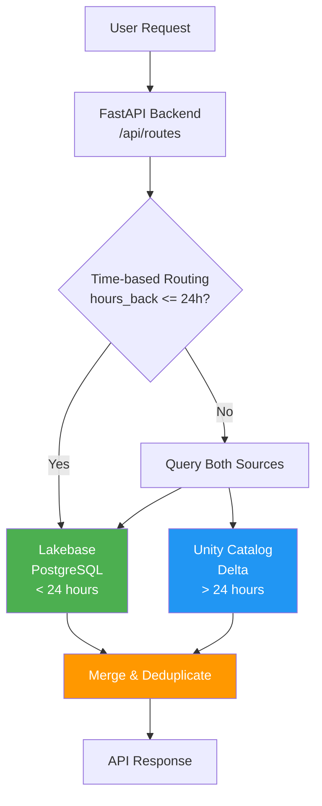
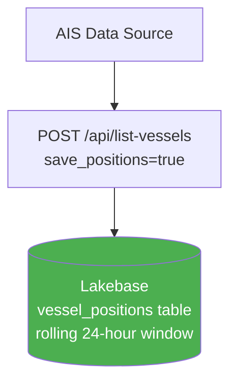
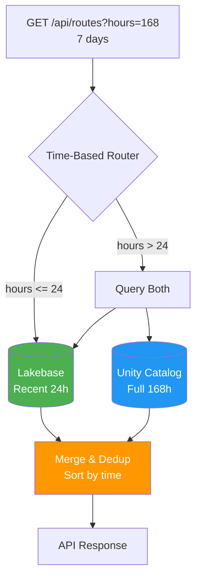
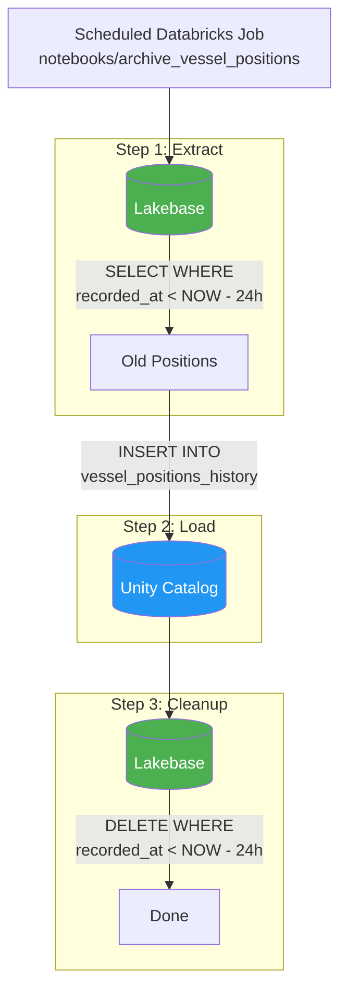

# Hybrid Storage Architecture: Lakebase + Unity Catalog

## Overview

World Monitor uses a hybrid storage architecture to optimize for both **fast UI interactions** (real-time data) and **cost-effective historical queries** (analytics workloads).



---

## Storage Comparison

| Characteristic | Lakebase (PostgreSQL) | Unity Catalog (Delta) |
|----------------|----------------------|----------------------|
| **Latency** | Sub-10ms | 100ms-2s |
| **Write Pattern** | High-frequency inserts | Batch appends |
| **Query Pattern** | Point lookups, recent scans | Full table scans, analytics |
| **Cost** | Higher (compute always on) | Lower (serverless) |
| **Retention** | Rolling window (24h) | Long-term (30+ days) |
| **Use Case** | Real-time UI, caching | Historical analysis |

---

## Data Flow

### 1. Real-Time Ingestion (Lakebase)



### 2. Historical Query (Hybrid)



### 3. Archival (Daily Job)



---

## API Endpoints

### Data Endpoints

| Endpoint | Method | Data Source | Description |
|----------|--------|-------------|-------------|
| `/api/list-vessels` | GET | Synthetic/AIS → Lakebase | Current vessel positions |
| `/api/snapshot` | GET | Synthetic/AIS → Lakebase | Real-time snapshot |
| `/api/vessel/{mmsi}/route` | GET | Lakebase → UC fallback | Single vessel route |
| `/api/routes` | GET | **Hybrid (time-based)** | All vessel routes |

### Admin Endpoints

| Endpoint | Method | Description |
|----------|--------|-------------|
| `/api/admin/storage-status` | GET | Check Lakebase/UC status |
| `/api/admin/archive-to-uc` | POST | Trigger manual archival |
| `/api/admin/generate-history` | POST | Generate synthetic history |
| `/api/admin/clear-history` | DELETE | Clear position history |

---

## Configuration

### Environment Variables

| Variable | Default | Description |
|----------|---------|-------------|
| `LAKEBASE_RETENTION_HOURS` | `24` | Hours to keep in Lakebase before archival |
| `UC_CATALOG` | `serverless_stable_3n0ihb_catalog` | Unity Catalog name |
| `UC_SCHEMA` | `worldmonitor_dev` | Schema for vessel history |
| `DATABRICKS_WAREHOUSE_ID` | - | SQL Warehouse for UC queries |
| `PGHOST`, `PGPORT`, `PGDATABASE`, `PGUSER` | - | Lakebase connection (from resource) |

### app.yaml Configuration

```yaml
env:
  # Hybrid storage: Lakebase retention threshold (hours)
  - name: LAKEBASE_RETENTION_HOURS
    value: "24"

  # Unity Catalog configuration
  - name: UC_CATALOG
    value: serverless_stable_3n0ihb_catalog
  - name: UC_SCHEMA
    value: worldmonitor_dev

  # Lakebase connection (auto-populated from resource)
  - name: PGHOST
    valueFrom: cache_db
  # ... etc

resources:
  - name: cache_db
    database:
      name: worldmonitor-cache
      permission: CAN_CONNECT
  - name: sql_warehouse
    sql_warehouse:
      name: "Serverless Starter Warehouse"
      permission: CAN_USE
```

---

## Tables

### Lakebase: `vessel_positions` (Recent Data)

```sql
CREATE TABLE vessel_positions (
    id BIGSERIAL PRIMARY KEY,
    mmsi TEXT NOT NULL,
    name TEXT,
    ship_type INTEGER DEFAULT 0,
    flag_country TEXT,
    latitude DOUBLE PRECISION NOT NULL,
    longitude DOUBLE PRECISION NOT NULL,
    speed DOUBLE PRECISION DEFAULT 0,
    course DOUBLE PRECISION DEFAULT 0,
    heading INTEGER DEFAULT 0,
    destination TEXT,
    is_synthetic BOOLEAN DEFAULT FALSE,
    recorded_at TIMESTAMP WITH TIME ZONE DEFAULT NOW()
);

-- Indexes for fast queries
CREATE INDEX idx_vessel_positions_mmsi ON vessel_positions(mmsi);
CREATE INDEX idx_vessel_positions_recorded_at ON vessel_positions(recorded_at);
CREATE INDEX idx_vessel_positions_mmsi_time ON vessel_positions(mmsi, recorded_at DESC);
```

### Unity Catalog: `vessel_positions_history` (Historical Data)

```sql
-- Delta table in Unity Catalog
CREATE TABLE IF NOT EXISTS {catalog}.{schema}.vessel_positions_history (
    mmsi STRING,
    name STRING,
    ship_type INT,
    flag_country STRING,
    latitude DOUBLE,
    longitude DOUBLE,
    speed DOUBLE,
    course DOUBLE,
    heading INT,
    destination STRING,
    is_synthetic BOOLEAN,
    recorded_at TIMESTAMP
)
USING DELTA
PARTITIONED BY (date(recorded_at))
TBLPROPERTIES ('delta.autoOptimize.optimizeWrite' = 'true');
```

---

## Query Logic (`server/db.py`)

### Time-Based Routing

```python
async def get_all_vessel_routes(hours_back: int = 24) -> dict[str, list[dict]]:
    """
    HYBRID ARCHITECTURE:
    - If hours_back <= LAKEBASE_RETENTION_HOURS: Query Lakebase only (fast)
    - If hours_back > LAKEBASE_RETENTION_HOURS: Query both sources and merge
    """
    use_lakebase = not db.is_demo_mode
    use_unity_catalog = hours_back > LAKEBASE_RETENTION_HOURS or db.is_demo_mode

    if hours_back <= LAKEBASE_RETENTION_HOURS:
        # Fast path: Lakebase only
        return await get_routes_from_lakebase(hours_back)
    else:
        # Hybrid path: merge both sources
        recent = await get_routes_from_lakebase(LAKEBASE_RETENTION_HOURS)
        historical = await get_routes_from_unity_catalog(hours_back)
        return _merge_vessel_routes(historical, recent)
```

### Route Merging

```python
def _merge_vessel_routes(historical, recent) -> dict[str, list[dict]]:
    """
    Merge historical (UC) and recent (Lakebase) data.
    - Deduplicate by timestamp
    - Sort chronologically
    """
    merged = {}
    all_mmsis = set(historical.keys()) | set(recent.keys())

    for mmsi in all_mmsis:
        seen_timestamps = set()
        combined = []

        for point in historical.get(mmsi, []) + recent.get(mmsi, []):
            ts = point.get("recorded_at")
            if ts and ts not in seen_timestamps:
                seen_timestamps.add(ts)
                combined.append(point)

        combined.sort(key=lambda p: p.get("recorded_at") or "")
        merged[mmsi] = combined

    return merged
```

---

## Scheduled Archival Job

### Setup in Databricks

1. Upload notebook: `notebooks/archive_vessel_positions.py`
2. Create scheduled job:

```bash
databricks jobs create --json '{
  "name": "WorldMonitor - Archive Vessel Positions",
  "tasks": [{
    "task_key": "archive",
    "notebook_task": {
      "notebook_path": "/Workspace/Users/.../notebooks/archive_vessel_positions"
    },
    "environment_key": "default"
  }],
  "environments": [{
    "environment_key": "default",
    "spec": {"client": "1"}
  }],
  "schedule": {
    "quartz_cron_expression": "0 0 2 * * ?",
    "timezone_id": "UTC"
  }
}'
```

### Manual Trigger

```bash
# Via API
curl -X POST https://your-app.databricksapps.com/api/admin/archive-to-uc

# Via notebook
databricks jobs run-now --job-id <job-id>
```

---

## Monitoring

### Check Storage Status

```bash
curl https://your-app.databricksapps.com/api/admin/storage-status
```

Response:
```json
{
  "lakebase_enabled": true,
  "unity_catalog_enabled": true,
  "lakebase_retention_hours": 24,
  "lakebase_position_count": 1500,
  "unity_catalog_available": true,
  "message": "Hybrid storage operational"
}
```

### Logs

Application logs show hybrid query decisions:

```
[db] Hybrid query: hours_back=168, lakebase=24h, uc=168h
[db] Got 15 vessel routes from Lakebase (recent 24h)
[db] Querying Unity Catalog for historical data (168h)
[db] Got 15 vessel routes from Unity Catalog
[db] Merged routes: 15 vessels total
```

---

## Trade-offs

| Aspect | Lakebase-Only | Unity Catalog-Only | Hybrid (Current) |
|--------|--------------|-------------------|------------------|
| **UI Latency (recent)** | Fast | Slow | Fast |
| **UI Latency (historical)** | N/A (no data) | Slow | Medium |
| **Storage Cost** | High | Low | Optimized |
| **Query Complexity** | Simple | Simple | Moderate |
| **Data Freshness** | Real-time | Batch | Real-time + Batch |

---

## Future Improvements

1. **Delta Lake Streaming**: Use Spark Structured Streaming to write directly to Delta, eliminating Lakebase for vessel positions entirely.

2. **Liquid Clustering**: Enable liquid clustering on the Delta table for faster time-range queries.

3. **Change Data Feed**: Use CDF to track changes and enable incremental processing.

4. **Predictive Caching**: Pre-warm Lakebase cache for frequently accessed historical routes.
