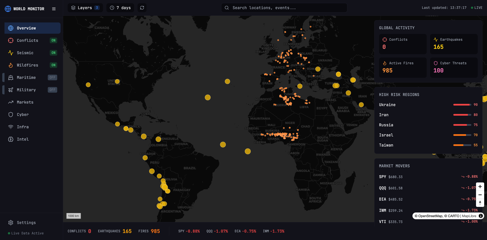
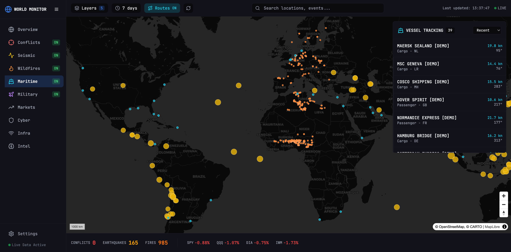
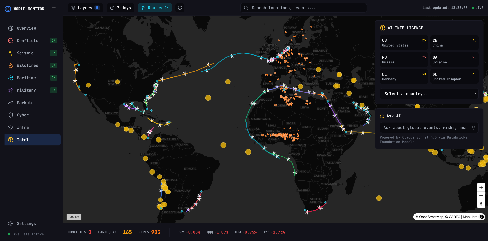
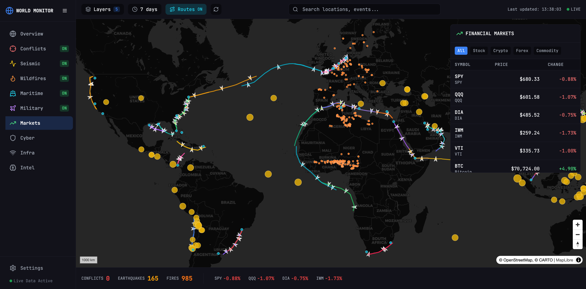
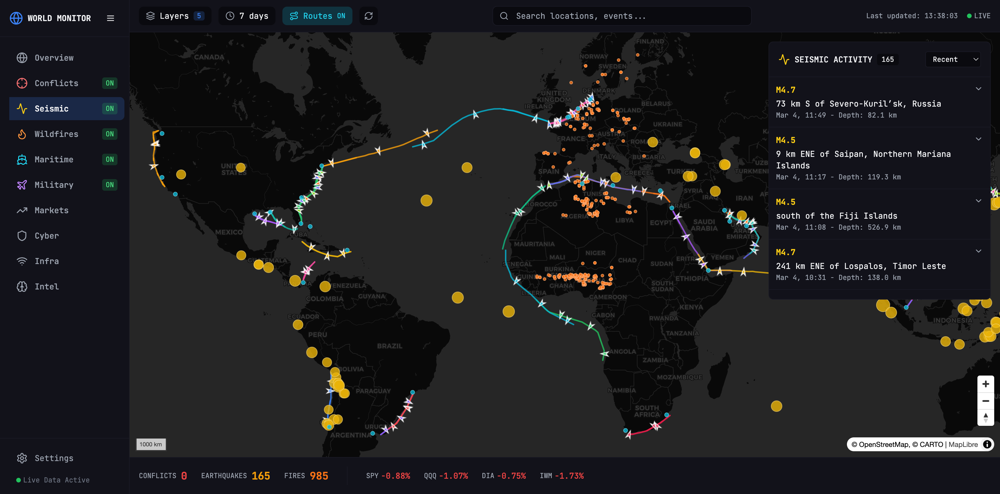

# World Monitor - User Guide

> **Real-time global intelligence powered by Databricks Lakebase + Lakehouse**



---

## What is World Monitor?

World Monitor is a **real-time geopolitical intelligence dashboard** that demonstrates the power of combining:

| Component | Technology | Purpose |
|-----------|------------|---------|
| **Real-Time Data** | Databricks Lakebase (PostgreSQL) | Sub-10ms live updates |
| **Historical Analytics** | Delta Lake + Unity Catalog | 30+ days of historical data |
| **AI Intelligence** | Claude Sonnet 4.5 via Foundation Models | Natural language analysis |

All running seamlessly on **Databricks Apps** - a fully managed, serverless application platform.

---

## Quick Start

### Access the Application

**Live Demo**: [https://worldmonitor-dev-7474645572615955.aws.databricksapps.com](https://worldmonitor-dev-7474645572615955.aws.databricksapps.com)

### Navigation

Use the sidebar to explore different data categories:

| Section | Description | What You'll See |
|---------|-------------|-----------------|
| **Overview** | Global dashboard | All layers combined on one map |
| **Conflicts** | Armed conflicts | ACLED & UCDP event markers |
| **Seismic** | Earthquakes M4.0+ | USGS data with magnitude colors |
| **Wildfires** | Satellite fire detections | NASA FIRMS hotspots |
| **Maritime** | Vessel tracking | AIS positions + historical routes |
| **Military** | Aircraft & bases | ADS-B flight tracking |
| **Markets** | Financial data | Stock indices & crypto prices |
| **Cyber** | Threat intelligence | IOC feeds |
| **Intel** | AI analysis | Country briefs & chat |

---

## Key Features

### 1. Toggle Map Layers

Each data category can be toggled ON/OFF:

- Click the **colored indicator** next to any nav item
- Multiple layers can be active simultaneously
- Layer count shows in "Layers" button (top bar)

**Pro Tip**: Enable Maritime + Conflicts together to see shipping risk areas.

---

### 2. Maritime Vessel Tracking

The Maritime section showcases the **Lakebase + Lakehouse hybrid architecture**:



#### Real-Time Positions (Lakebase)
- Vessel markers show **current positions** with sub-10ms latency
- Click any vessel for speed, course, and flag details

#### Historical Routes (Delta Lake)
1. Click **"Routes"** button to load 7-30 days of route history
2. **Select a vessel** from the right panel
3. Selected vessel route **glows** with full opacity
4. Other routes **dim** to 25% for focus
5. Click again to deselect

> **Demo Script**: "The current positions come from Lakebase for real-time updates, while the historical routes are queried from Delta Lake in Unity Catalog. Both work seamlessly together."

#### Route Visualization Details
- Each vessel has a **unique color** for easy identification
- **Directional arrows** show vessel heading every ~40 hours
- **Hover** over route points to see timestamp, speed, and course

---

### 3. AI Intelligence Panel

Navigate to **Intel** to access AI-powered features:



#### Country Risk Scores
- View risk scores for major countries (Ukraine: 90, Iran: 80, Russia: 75...)
- Click any country chip for quick selection
- Use dropdown for full country list

#### Ask AI Chat
Natural language questions about global events:

- *"What are the current geopolitical hotspots?"*
- *"Summarize recent seismic activity in the Pacific"*
- *"Which shipping lanes have the most military activity?"*
- *"Compare risk factors between Syria and Lebanon"*

**Powered by**: Claude Sonnet 4.5 via Databricks Foundation Model API

---

### 4. Financial Markets

Real-time stock and crypto data:



- **Stock Indices**: SPY, QQQ, DIA, IWM, VTI
- **Crypto**: BTC, ETH, and more
- **Economic Indicators**: Fed rates, GDP data

---

### 5. Seismic Activity

Earthquake monitoring from USGS:



- **Magnitude filtering**: M4.0+ earthquakes displayed
- **Color coding**: Yellow (M4-5), Orange (M5-6), Red (M6+)
- **Alert levels**: USGS PAGER alerts when available
- **Expandable details**: Depth, coordinates, felt reports

---

### 6. Time Range Selection

Control historical data window with the time selector (top bar):

| Range | Use Case |
|-------|----------|
| **7 days** | Recent events (default) |
| **14 days** | Extended analysis |
| **30 days** | Full historical view |

Changing the range:
- Refreshes all API data
- Updates vessel route history from Delta Lake
- Re-queries earthquake and conflict events

---

## Architecture Highlights

### Hybrid Storage Strategy

```
User Request → FastAPI Backend → Time-based Router
                                       │
                    ┌──────────────────┴──────────────────┐
                    │                                      │
                    ▼                                      ▼
            hours_back <= 24h?                     hours_back > 24h?
                    │                                      │
                    ▼                                      ▼
              ┌──────────┐                         ┌──────────────┐
              │ Lakebase │                         │ Unity Catalog│
              │ (Postgres)│                        │ (Delta Lake) │
              └──────────┘                         └──────────────┘
                    │                                      │
                    └──────────────┬───────────────────────┘
                                   │
                                   ▼
                          Merge & Deduplicate
                                   │
                                   ▼
                            API Response
```

### Why This Architecture?

| Requirement | Solution | Databricks Feature |
|-------------|----------|-------------------|
| Sub-10ms UI updates | PostgreSQL caching | **Lakebase** |
| 30+ days historical data | Columnar storage | **Delta Lake** |
| Cost optimization | Query on demand | **Unity Catalog** |
| AI analysis | LLM access | **Foundation Models** |
| Unified governance | Single catalog | **Unity Catalog** |

### Data Flow: Vessel Positions

1. **Ingestion**: AIS data received → Written to Lakebase (real-time)
2. **Archival**: Scheduled job copies Lakebase → Delta Lake (hourly)
3. **Cleanup**: Lakebase retains rolling 24h window
4. **Query**: UI requests → Router chooses optimal source
5. **Response**: Merged data from both sources, deduplicated by MMSI + timestamp

---

## Demo Scenarios

### Scenario 1: Maritime Intelligence

1. Navigate to **Maritime**
2. Enable the Maritime layer (if not already ON)
3. Click **"Routes"** to show historical tracks
4. Select **MAERSK SEALAND** in the vessel list
5. Watch the route highlight with glow effect
6. Navigate to **Intel** and ask: *"What vessels are in the North Sea?"*

### Scenario 2: Risk Analysis

1. Go to **Overview** with Conflicts + Earthquakes enabled
2. Click a conflict marker to see event details
3. Navigate to **Intel**
4. Select **Ukraine** from the country chips
5. Discuss how the AI synthesizes conflict density and regional stability

### Scenario 3: Historical Patterns

1. Navigate to **Seismic**
2. Change time range to **30 days**
3. Observe how Delta Lake efficiently retrieves a month of seismic history
4. Ask AI: *"Are there any seismic patterns in the Ring of Fire this month?"*

---

## Talking Points

### For Data Engineers
- **Hybrid OLTP/OLAP**: Lakebase for transactions, Delta Lake for analytics
- **Unity Catalog**: Single governance layer across both storage systems
- **Serverless compute**: No cluster management, pay-per-query

### For Solution Architects
- **Real-time + Historical**: Single application serves both needs
- **Cost optimization**: Hot data in PostgreSQL, cold data in object storage
- **Scalability**: Lakebase scales vertically, Delta Lake scales horizontally

### For Business Users
- **Unified interface**: No switching between operational and analytical tools
- **AI-powered insights**: Natural language access to complex data
- **Global coverage**: 15+ data sources aggregated in real-time

---

## Troubleshooting

| Issue | Solution |
|-------|----------|
| Map not loading | Refresh page, check browser console |
| Routes not showing | Enable Maritime layer first, then click Routes |
| Vessel selection not working | Ensure Maritime layer is ON and Routes enabled |
| AI chat not responding | Check Intel panel, may need page refresh |
| Slow historical queries | Normal for 30-day range - Delta Lake optimizing scan |

---

## Links

- **Live App**: [worldmonitor-dev-7474645572615955.aws.databricksapps.com](https://worldmonitor-dev-7474645572615955.aws.databricksapps.com)
- **Logs**: [/logz](https://worldmonitor-dev-7474645572615955.aws.databricksapps.com/logz)
- **API Docs**: [API.md](API.md)
- **Data Dictionary**: [DATA_DICTIONARY.md](DATA_DICTIONARY.md)

---

## Summary

World Monitor demonstrates how **Databricks unifies real-time and historical data** in a single platform:

1. **Lakebase** - Managed PostgreSQL for sub-10ms operational data
2. **Lakehouse** - Delta Lake + Unity Catalog for cost-effective analytics
3. **Foundation Models** - Embedded AI for natural language analysis

*"Real-time data. Historical analytics. AI intelligence. One platform."*
