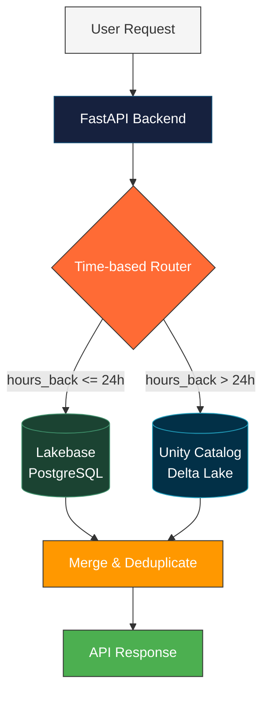

# World Monitor - User Guide

## Demonstrating Lakebase + Lakehouse in Action

World Monitor showcases how **Databricks Lakebase** (managed PostgreSQL) and **Lakehouse** (Delta Lake + Unity Catalog) work together seamlessly to deliver both **real-time operational data** and **historical analytics** in a single application, with **embedded LLM intelligence** powered by Databricks Foundation Models.

---

## Key Demo Value Proposition

```mermaid
flowchart TB
    subgraph PLATFORM["Real-Time + Historical Analytics in One Platform"]
        direction TB

        subgraph REALTIME["REAL-TIME DATA (Lakebase)"]
            RT1["Live vessel positions"]
            RT2["Current market prices"]
            RT3["Active earthquake alerts"]
            RT4["Sub-10ms response time"]
        end

        subgraph HISTORICAL["HISTORICAL DATA (Lakehouse)"]
            HI1["30-day route history"]
            HI2["Trend analysis"]
            HI3["Historical patterns"]
            HI4["Cost-effective storage"]
        end

        subgraph LLM["LLM INTELLIGENCE<br/>Claude Sonnet 4.5<br/>via Foundation API"]
            Q1["What are the geopolitical hotspots?"]
            Q2["Summarize vessel activity in the Gulf"]
            Q3["Generate a country risk brief for Syria"]
        end

        REALTIME --> LLM
        HISTORICAL --> LLM
    end

    style PLATFORM fill:#1a1a2e,stroke:#ff6b35,stroke-width:2px
    style REALTIME fill:#1b4332,stroke:#40916c
    style HISTORICAL fill:#023047,stroke:#219ebc
    style LLM fill:#3d0066,stroke:#9d4edd
```

---

## Getting Started

### Access the Application

**Live Demo URL**: https://worldmonitor-dev-7474645572615955.aws.databricksapps.com

### Navigation

The sidebar provides access to all data categories:

| Section | Description | Data Source |
|---------|-------------|-------------|
| **Overview** | Global dashboard with all layers | Combined |
| **Conflicts** | Armed conflict events worldwide | ACLED, UCDP |
| **Seismic** | Earthquakes M4.0+ | USGS |
| **Wildfires** | Satellite fire detections | NASA FIRMS |
| **Maritime** | Vessel tracking & routes | AIS Data |
| **Military** | Aircraft & base tracking | ADS-B |
| **Markets** | Stock indices & crypto | Finnhub, CoinGecko |
| **Cyber** | Threat intelligence IOCs | Various feeds |
| **Intel** | AI-powered analysis & chat | Foundation Models |

---

## Feature Walkthrough

### 1. Map Layers - Toggle Real-Time Data

Each data category can be toggled ON/OFF independently:

- **Click the colored indicator** (left of nav item) to toggle layer visibility
- **Click the ON/OFF badge** for quick toggle
- **Multiple layers** can be active simultaneously
- Layer count shown in "Layers" button (top bar)

**Demo Tip**: Show how enabling Maritime + Conflicts together reveals potential shipping risk areas.

### 2. Maritime Vessel Tracking - Real-Time + Historical

The Maritime section demonstrates the Lakebase + Lakehouse hybrid architecture:

#### Current Positions (Lakebase - Real-Time)
- Vessel markers show **current positions** from Lakebase cache
- Sub-10ms response time for live updates
- Click any vessel for speed, course, and flag details

#### Historical Routes (Delta Lake - Analytics)
1. **Enable Routes**: Click "Routes" button to show historical tracks
2. **Select a Vessel**: Click any vessel name in the right panel
3. **Route Highlighting**: Selected vessel route glows with full opacity
4. **Other Routes Dimmed**: Unselected routes fade to 25% opacity
5. **Click Again to Deselect**: Returns to normal view

**Demo Script**:
> "This shows 30 days of vessel position history stored in Delta Lake. The current positions come from Lakebase for sub-10ms latency, while historical routes are queried from Unity Catalog. Both work seamlessly together."

#### Route Visualization Details
- Each vessel has a **unique color** for easy identification
- **Directional arrows** show vessel heading every ~40 hours
- **Hover** over route points to see timestamp, speed, and course
- **Time range selector** (7 days default) controls historical window

### 3. AI Intelligence Panel - Embedded LLM Chat

Navigate to **Intel** to access AI-powered features:

#### Country Risk Briefings
- Select any country from the world risk heatmap
- Click "Generate Brief" for AI analysis
- Claude Sonnet 4.5 synthesizes data from all sources

#### Ask AI Chat
- Natural language questions about global events
- Examples:
  - "What are the current geopolitical hotspots?"
  - "Summarize recent seismic activity in the Pacific"
  - "Which shipping lanes have the most military activity?"
  - "Compare risk factors between Syria and Lebanon"

**Demo Script**:
> "The embedded LLM has access to all our data sources. Ask it about current events and watch it synthesize real-time data from conflicts, earthquakes, shipping, and markets into coherent analysis."

### 4. Time Range Selection

The "7 days" button (top bar) controls the historical data window:

- **7 days** (default) - Recent events
- **14 days** - Extended view
- **30 days** - Full historical range

Changing time range:
- Refreshes all API data for the new window
- Updates vessel route history from Delta Lake
- Re-queries earthquake and conflict events

**Demo Tip**: Switch to 30 days to show how Delta Lake efficiently stores and retrieves weeks of historical data.

---

## Architecture Deep Dive (For Technical Audiences)

### Hybrid Storage Strategy

### Why This Architecture?

| Requirement | Solution | Databricks Feature |
|-------------|----------|-------------------|
| Sub-10ms UI updates | PostgreSQL caching | **Lakebase** |
| 30+ days historical data | Columnar storage | **Delta Lake** |
| Cost optimization | Query on demand | **Unity Catalog** |
| AI analysis | GPT/Claude access | **Foundation Models** |
| Unified governance | Single catalog | **Unity Catalog** |

### Data Flow Example: Vessel Positions

1. **Ingestion**: AIS data received → Written to Lakebase (real-time)
2. **Archival**: Scheduled job copies Lakebase → Delta Lake (hourly)
3. **Cleanup**: Lakebase retains rolling 24h window
4. **Query**: UI requests → Router chooses optimal source
5. **Response**: Merged data from both sources, deduplicated by MMSI + timestamp

---

## Demo Scenarios

### Scenario 1: Maritime Intelligence Briefing

**Setup**: Navigate to Maritime, enable Maritime layer

**Script**:
1. "Here we see live vessel positions across global shipping lanes"
2. Enable Routes: "Now we pull 7 days of route history from Delta Lake"
3. Click vessel: "Selecting MAERSK SEALAND highlights its route with a glow effect"
4. "Notice how other routes dim - this is data-driven styling in MapLibre GL"
5. Switch to Intel: "Let me ask the AI about shipping activity..."
6. Type: "What vessels are operating in the North Sea and what are their patterns?"
7. "Claude Sonnet 4.5 synthesizes our real-time and historical data"

### Scenario 2: Geopolitical Risk Analysis

**Setup**: Navigate to Overview with Conflicts + Earthquakes enabled

**Script**:
1. "The map shows armed conflict events from ACLED alongside USGS earthquakes"
2. Click conflict marker: "Each event has fatalities, actors, and notes"
3. Navigate to Intel: "Let's generate a risk briefing"
4. Select country (e.g., Syria): "Generate Brief"
5. "The AI analyzes conflict density, economic factors, and regional stability"
6. "This combines structured Delta Lake data with LLM reasoning"

### Scenario 3: Historical Pattern Analysis

**Setup**: Navigate to Seismic

**Script**:
1. "Current earthquake data from USGS - magnitude 4.0 and above"
2. Change time range to 30 days: "Now querying Delta Lake for a month of seismic history"
3. "Notice the response time - Delta Lake with serverless SQL handles this efficiently"
4. Navigate to Intel, ask: "Are there any seismic patterns in the Ring of Fire this month?"
5. "The LLM can identify trends humans might miss"

---

## Key Talking Points

### For Data Engineers
- **Hybrid OLTP/OLAP**: Lakebase handles transactional writes, Delta Lake handles analytical queries
- **Unity Catalog**: Single governance layer across both storage systems
- **Serverless compute**: No cluster management, pay-per-query for analytics

### For Solution Architects
- **Real-time + Historical**: Single application serves both needs
- **Cost optimization**: Hot data in PostgreSQL, cold data in object storage
- **Scalability**: Lakebase scales vertically, Delta Lake scales horizontally

### For Business Users
- **Unified interface**: No need to switch between operational and analytical tools
- **AI-powered insights**: Natural language access to complex data
- **Global coverage**: 15+ data sources aggregated in real-time

---

## Troubleshooting

| Issue | Solution |
|-------|----------|
| Map not loading | Refresh page, check browser console for errors |
| Routes not showing | Enable Maritime layer first, then click Routes button |
| Vessel selection not working | Ensure Maritime layer is ON and Routes are enabled |
| AI chat not responding | Check Intel panel, may need page refresh |
| Slow historical queries | Normal for 30-day range - Delta Lake optimizing scan |

---

## Links

- **Live App**: https://worldmonitor-dev-7474645572615955.aws.databricksapps.com
- **Logs**: https://worldmonitor-dev-7474645572615955.aws.databricksapps.com/logz
- **API Docs**: See [API.md](API.md)
- **Data Dictionary**: See [DATA_DICTIONARY.md](DATA_DICTIONARY.md)
- **Architecture**: See [HYBRID_STORAGE_ARCHITECTURE.md](HYBRID_STORAGE_ARCHITECTURE.md)

---

## Summary

World Monitor demonstrates the power of combining:

1. **Lakebase** - Managed PostgreSQL for real-time, sub-10ms operational data
2. **Lakehouse** - Delta Lake + Unity Catalog for cost-effective historical analytics
3. **Foundation Models** - Embedded LLM intelligence for natural language analysis

All running on **Databricks Apps** - a fully managed, serverless application platform.

*"Real-time data. Historical analytics. AI intelligence. One platform."*
